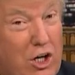
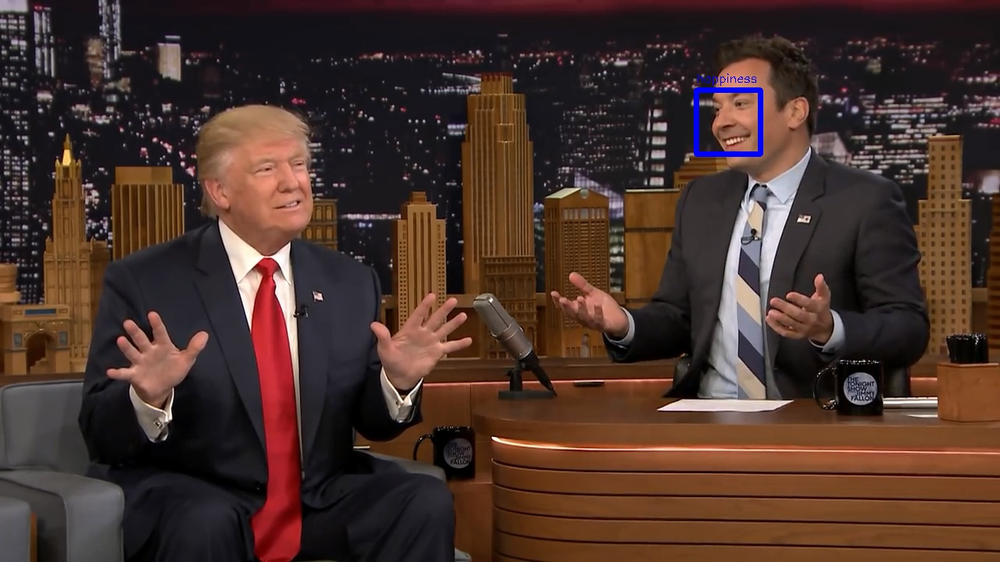

# youtube Reaction Face Finder

Quick side project to extract top examples of different facial expressions from a youtube video.  Project work was done during 'Innovation Week' at Eastman Chemical Company.  Code was not written with any high production standards (due to short timeline of project).  Code uses Microsoft Emotion API and relies on a file named api_keys containing your emotion api keys; formatting for this file can be seen in example_api_keys.

Idea for project was to be able to extract reaction faces from a video for use in a chat or for whatever reason the user/memer wants.

### Example:
Example code to pull reaction faces from youtube video 'Donald Trump Lets Jimmy Fallon Mess Up His Hair' from the youtube channel: The Tonight Show Starring Jimmy Fallon.

    python yt_reaction_faces.py  -y https://www.youtube.com/watch?v=u0BYqzdiuJc -o example_output -m 200
    
  * arguments used:
    - `-y` : youtube video's url
    - `-o` : reaction face output directory
    - `-m` : max frames to examine (starts at begining of video; assumes ~60 fps)

### Example output:

#### Anger:

#### Sadness:

#### Happiness:

